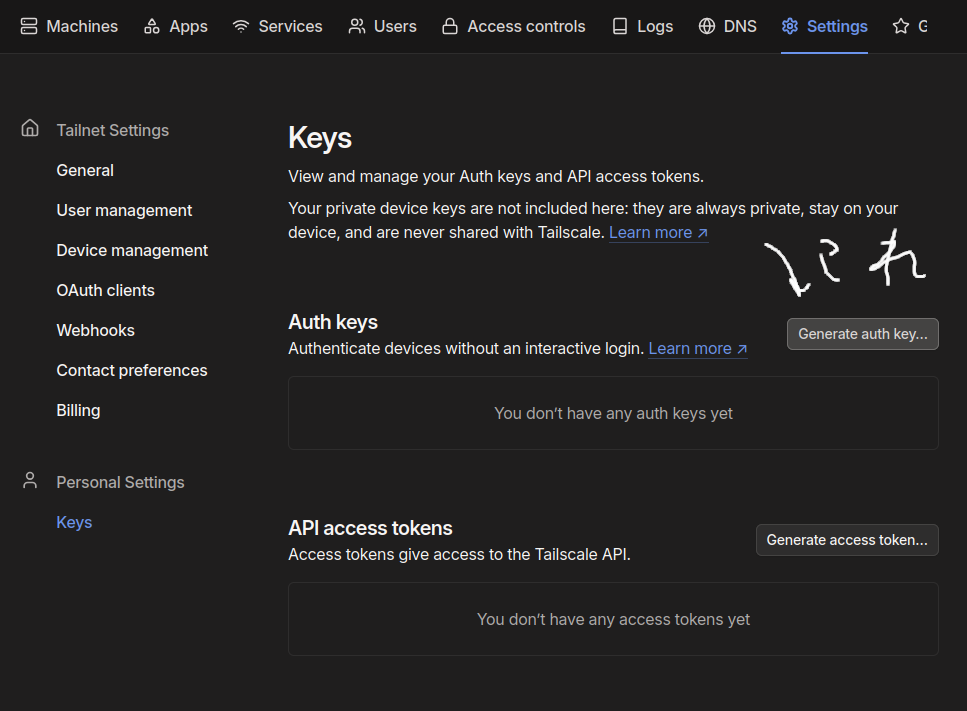
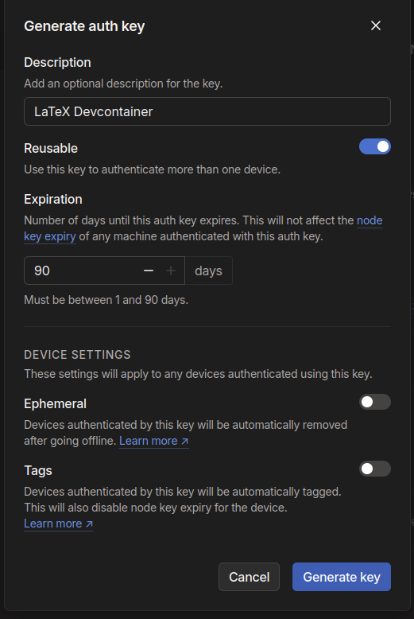
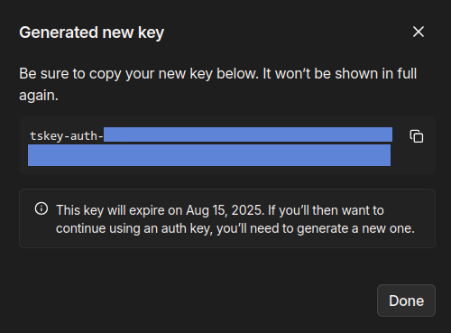

# 設定方法

## ホスト環境でする作業
LaTeX フォルダで作業してることが前提みたいなところある

### AuthKey を作成
Tailscale の Authkey を作成する
これ使うとログインの代わりにトークンを指定するだけで良くなって楽 & セキュリティ◯




詳細を設定

Generate key を押す

こんな感じになる

`tskey-auth-xxx` が AuthKey (普通に機密情報)
後で使うのでどこかにメモ

### `.env` ファイルを作成

`.devcontainer/.env` を次のような内容で作成する
```env
TS_AUTHKEY=(取得したAuthKey)
TS_HOSTNAME=(識別子. latex とかで大丈夫)
```

### `.cs-pw` ファイルを作成

`.devcontainer/.cs-pw` を次のような内容で作成する
```env
(VSCode サーバーで使う任意のパスワード)
```

### コンテナを開く

VSCode の左下のボタンを教えて `Reopen in Container` を選択