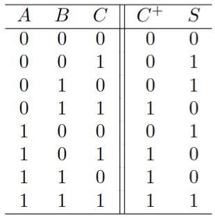

# Table 自動生成

このドキュメントでは命令付き CSV ファイルから `table` 環境を使った LaTeX コードを生成するツールの使い方を説明します。

## ファイルの配置

`(レポートルート: PROJECT)/data/*/table.csv` に配置

## メタデータ

- `columns`: カラムの定義. table 環境にそのまま渡されます (e.g. `c|c|c`)

## 命令

このツールでは第一カラムが特定の文字列だったときにそれを命令として解釈します。
命令行の第二カラムからはその命令の引数として解釈されます。
現在定義されている命令は以下の通りです。

| 命令                           | 説明             |
| ------------------------------ | ---------------- |
| `__meta__, (フィールド), (値)` | メタデータの定義 |
| `__special__, hline`           | 横線の描画       |

## 数式の埋め込み

セルの中身がそのまま LaTeX ソースとして解釈されるので，`$` で囲むことで数式を埋め込むことができます．
ただし，`$` をそのまま表示したい場合は `\textdollar` を使ってください．

例: `$ (A + B)^2 = A^2 + 2AB + B^2 $`

## 例
```csv
__meta__,title   ,全加算器の真理値表
__meta__,columns ,ccc||cc

__special__,hline
$ A $, $ B $, $ C $, $ C^{+ $}, $ S $
__special__,hline
0, 0, 0, 0, 0
0, 0, 1, 0, 1
0, 1, 0, 0, 1
0, 1, 1, 1, 0
1, 0, 0, 0, 1
1, 0, 1, 1, 0
1, 1, 0, 1, 0
1, 1, 1, 1, 1
```

